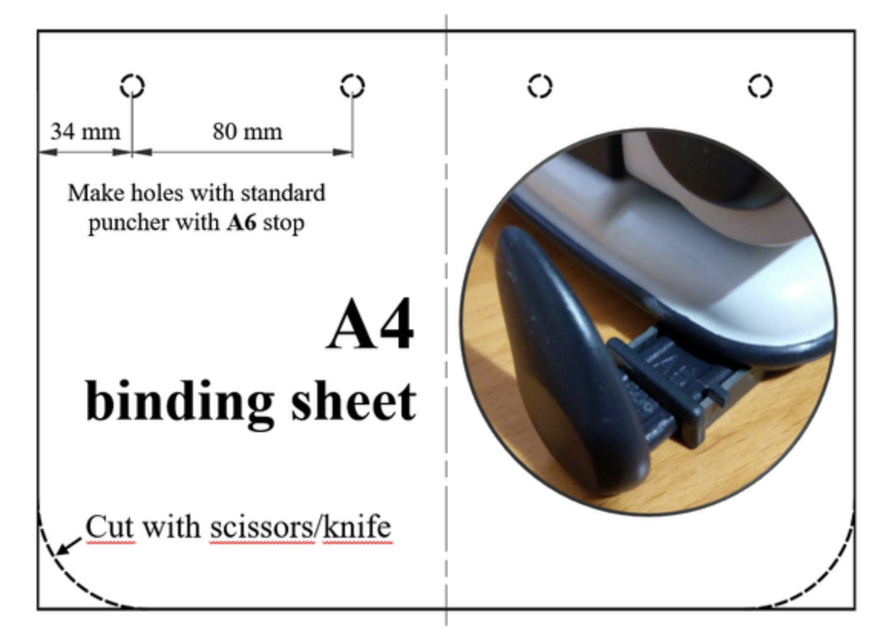

# East Essex Hackspace Covid-19 Laser Cut Face Mask 

This is our take on the great laser cut mask that Kitronic, Nottingham Hackspace and Smoke & Mirrors have created.  We have made some adjustments to better suit our laser cutting setup

## Fundraising
We are raising money to assist us in the production of my face masks, you can see our GoFundme page [https://tiny.cc/eeh-ppe](https://tiny.cc/eeh-ppe).  Please share, all money goes directly back in to helping healthcare workers and the community.

All money raised is paid into the non profit East Essex Hackspace CIC ltd company no. 11882927 and is kept by the community under asset lock - that means it can't enter private hands and should the CIC be disbanded, all proceeds are donated to local charity, so rest assured any help you provide will be used to its maximum benefit.  Nobody at the CIC draws a wage, it is 100% volunteers only.

We are using the money to increase the capacity of production, by buying a large laser cutter and by buying materials.

The East Essex Hackspace is a community resource, so once this situation is over the laser cutter will be available for anyone to use at a very low cost: the cost of the power and a tiny amount to cover laser tube replacement.

We have so far reached our primary goal to get the cutter which is arriving on 13/4/2020, we have also used the money to purchase additional stock to produce these headbands and other PPE equipment.

So far we have produced 1,500 full masks and 500 ear savers.  Once the new cutter arrives and we can begin using that and capacity will greatly increase.  We have stock to produce almost 9,000 masks, every donation helps extend that number further.

So far masks have been given to:
- hospitals
- GPs
- care homes
- pharmacists
- funeral directors
- radiologists
- renal care

## Our Adaptations
- lengthened the adjustable strap to accomodate larger heads
- removed two support bands to reduce the width and fit better on the glowforges cutting bed
- coloured the lines to define a cutting order
- adjusted a couple cutting lines to increase cutting speed by forcing a further optimised cutting path

## Credit and Thanks
- [Smoke and Mirrors](https://smokeandmirrors.store/) and discussion can be found [here](https://community.andmirrors.co.uk/t/covid-19-laser-cut-face-shield/168)
- [Kitronic](https://www.kitronik.co.uk/) with their blog post [here](https://www.kitronik.co.uk/blog/kitronik-make-nhs-frontline-ppe-visors/)
- [Nottingham Hackspace](https://nottinghack.org.uk/) with further details [here](https://wiki.nottinghack.org.uk/wiki/LaserCutCOVID-19_PPE)

## Files
| Version | Cutting Dimensions | Cutter | Mask Pieces | Layout | Notes |
| :-- | :-- | :-- | :-- | :-- | :-- |
| [glowforge/v4](glowforge/490x264_Covid_19_Facemask_-_V0.5.1_EEH_Glowforge_basic_size_v4.svg) | 490x264mm | Glowforge Basic | 5xstrap, 5xband, 3xsupport | [cutting plan](images/490x264_Covid_19_Facemask_-_V0.5.1_EEH_Glowforge_basic_size_v4_cutting_plan.png) | maximum efficiency for cutting on glowforge basic bed |

## Preferred Cutting Order
- green
- black
- blue
- red

## Material
- 0.5mm or 0.8mm polypropylene sheeting.  0.5mm [here](https://www.kitronik.co.uk/materials/polypropylene/0-5mm-polypropylene-sheets.html) and 0.8mm [here](https://www.kitronik.co.uk/materials/polypropylene/0-8mm-polypropylene-sheets.html)
- Unpunched A4 clear acetate or PVC sheets of 150 micron thickness, an example can be found [here](https://smile.amazon.co.uk/Star-Office-Binding-Covers-micron/dp/B000J6F6EU)

## Punching Holes
It is simple and easy, get a standard 2 hole punch and set it to A6.  Then on each end of the clear sheet punch the holes.  This will make them align properly.

Image Source: [Smoke and Mirrors Forum](https://community.andmirrors.co.uk/t/covid-19-laser-cut-face-shield/168)

## Assembly
Here is a nice video which describes how to assemble the mask

