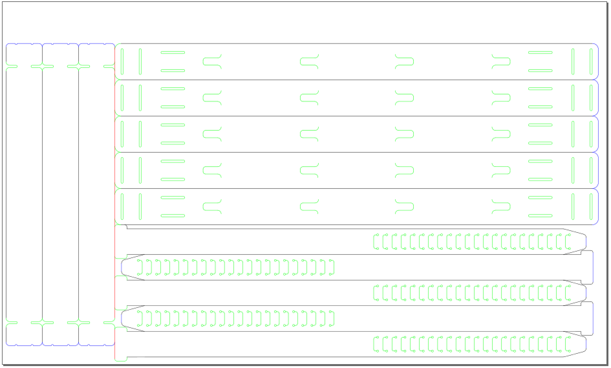
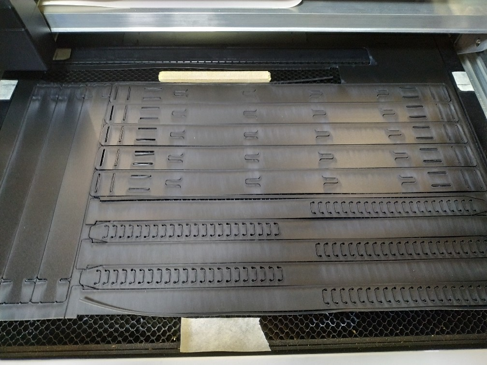

# covid-19-lasercut-face-mask

This is our take on the great laser cut mask that Kitronic, Nottingham Hackspace and Smoke & Mirrors have created.  We have made some adjustments to better suit our laser cutting setup

Adaptations
- lengthened the adjustable strap to accomodate larger heads
- removed two support bands to reduce the width and fit better on the glowforges cutting bed
- coloured the lines to define a cutting order
- adjusted a couple cutting lines to increase cutting speed by forcing a further optimised cutting path

Credit and Thanks
- [Smoke and Mirrors](https://smokeandmirrors.store/) and discussion can be found [here](https://community.andmirrors.co.uk/t/covid-19-laser-cut-face-shield/168)
- [Kitronic](https://www.kitronik.co.uk/) with their blog post [here](https://www.kitronik.co.uk/blog/kitronik-make-nhs-frontline-ppe-visors/)
- [Nottingham Hackspace](https://nottinghack.org.uk/) with further details [here](https://wiki.nottinghack.org.uk/wiki/LaserCutCOVID-19_PPE)

| File | Cutting Dimensions | Cutter | Mask Pieces | Notes |
| :-- | :-- | :-- | :-- | :-- |
| 490x264_Covid_19_Facemask_-_V0.5.1_EEH_Glowforge_basic_size_v2.svg | 490x264mm | Glowforge Basic | 5xstrap, 5xband, 3xsupport | original file |
| 490x264_Covid_19_Facemask_-_V0.5.1_EEH_Glowforge_basic_size_v3.svg | 490x264mm | Glowforge Basic | 5xstrap, 5xband, 3xsupport | latest |

Preferred Cutting Order
- green
- black
- blue
- red

Material
- 0.5mm or 0.8mm polypropylene sheeting.  [0.5mm here](https://www.kitronik.co.uk/materials/polypropylene/0-5mm-polypropylene-sheets.html)  [0.8mm here](https://www.kitronik.co.uk/materials/polypropylene/0-8mm-polypropylene-sheets.html)
- Unpunched A4 clear acetate or PVC sheets of 150 micron thickness, an example can be found [here](https://smile.amazon.co.uk/Star-Office-Binding-Covers-micron/dp/B000J6F6EU)

