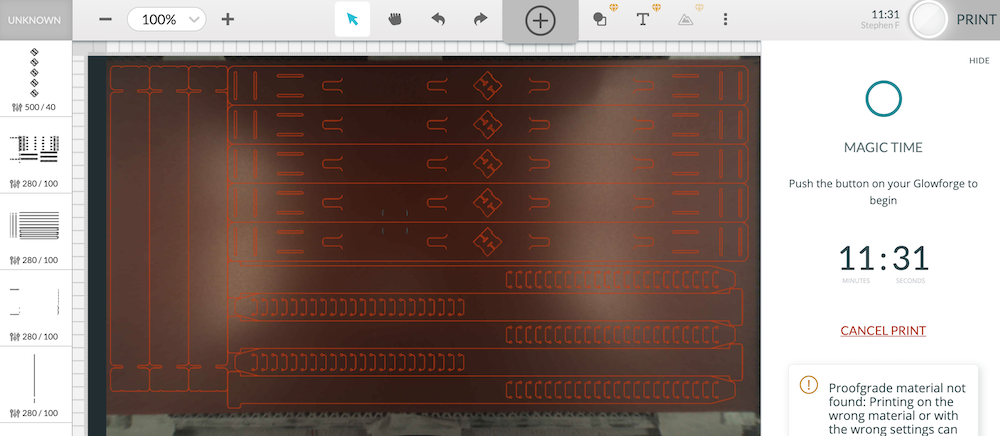

# Notes

These plans are designed to maximise the cutting efficiency for use on a glowforge basic.

The cutting bed is officially 495x279mm but to use it to its fullest X and Y boundaries is hard.  We are using large sheets of 1050x750 which we cut down to a size of 515x269mm.  This results in a single large offcut sheet measuring 515x210mm that we use to cut extra forehead bands and extra sets.  Plans for use of this offcut will be uploaded shortly.

Each cut below takes about 11 minutes with a setting of 280 speed, 100% power and a single pass.

The files produce 5 straps, 5 front and 3 forehead bands.  Meaning an additional 2 forehead bands need to be cut from the 515x210 offcut.

# Files
| Version | Cutting Dimensions | Cutter | Mask Pieces | Layout | Notes |
| :-- | :-- | :-- | :-- | :-- | :-- |
| [glowforge/v2](490x264_Covid_19_Facemask_-_V0.5.1_EEH_Glowforge_basic_size_v2.svg) | 490x264mm | Glowforge Basic | 5xstrap, 5xband, 3xsupport | [cutting plan](../images/490x264_Covid_19_Facemask_-_V0.5.1_EEH_Glowforge_basic_size_v2_cutting_plan.png) | maximum efficiency for cutting on glowforge basic bed |
| [glowforge/v3](490x264_Covid_19_Facemask_-_V0.5.1_EEH_Glowforge_basic_size_v3.svg) | 490x264mm | Glowforge Basic | 5xstrap, 5xband, 3xsupport | [cutting plan](../images/490x264_Covid_19_Facemask_-_V0.5.1_EEH_Glowforge_basic_size_v3_cutting_plan.png) | maximum efficiency for cutting on glowforge basic bed |
| [glowforge/v4](490x264_Covid_19_Facemask_-_V0.5.1_EEH_Glowforge_basic_size_v4.svg) | 490x264mm | Glowforge Basic | 5xstrap, 5xband, 3xsupport | [cutting plan](../images/490x264_Covid_19_Facemask_-_V0.5.1_EEH_Glowforge_basic_size_v4_cutting_plan.png) | Hackspace logo added, maximum efficiency for cutting on glowforge basic bed |
| [forehead straps](forehead_straps_v4.svg) | 179.9x249.78mm | Glowforge Basic | 6xsupport | [cutting plan](../images/forehead_straps_v4_cutting_plan.png) | 6 additional forehead support straps |

# Glowforge Cutting Settings
| Type | Material | Speed | Power | Passes | Focus Height | Result |
| :-- | :-- | :-- | :-- | :-- | :-- | :-- |
| cut | 0.5mm Polypropylene sheet | 280 | 100 | 1 | 0.5mm | Cuts cleanly 100% of time |
| cut | 0.5mm Polypropylene sheet | 400 | 90 | 3 | 0.5mm | 100% cut (just), requires clean up hand cutting |
| engrave | 0.5mm Polypropylene sheet | 500 | 40 | 1 | 0.5mm | good |

# Preferred Cutting Order
| Order | Colour | Type | Speed | Power | Passes |
| :-- | :-- | :-- | :-- | :-- | :-- |
| 1 | magenta/purple | engrave | 500 | 40 | 1 |
| 2 | green | cut | 280 | 100 | 1 |
| 3 | black | cut | 280 | 100 | 1 |
| 4 | blue | cut | 280 | 100 | 1 |
| 5 | red | cut | 280 | 100 | 1 |

# Screen Shot

